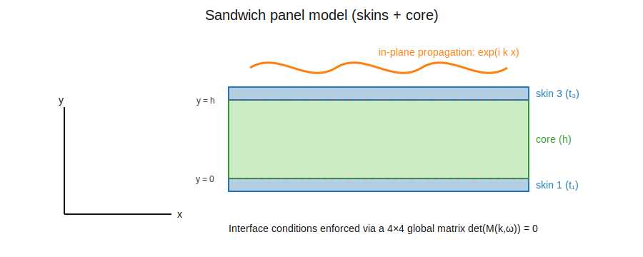
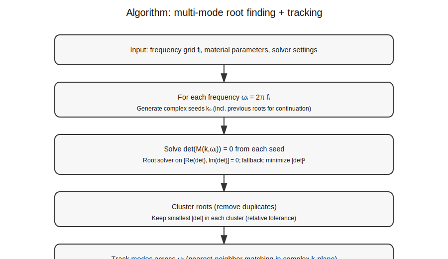

# Report — Complex wavenumber extraction for a sandwich panel

This report documents the mathematical model and the numerical procedure implemented in this repository to compute the **complex in‑plane wavenumber** \(k(\omega)\) for a sandwich panel.

- Convention used throughout: **time dependence** \(e^{+i\omega t}\).
- In‑plane propagation: \(e^{i k x}\).
- Complex \(k\):
  - \(\Re\{k\}\) controls phase/dispersion.
  - \(\Im\{k\}\) controls in‑plane attenuation.

Figures:
- `figs/sandwich_schematic.svg`
- `figs/solver_flow.svg`

---

## 1. Geometry and layers

A 3‑layer sandwich is assumed:

- bottom skin (layer 1), thickness \(t_1\)
- core (layer 2), thickness \(h\)
- top skin (layer 3), thickness \(t_3\)

The interfaces are at \(y=0\) and \(y=h\) (core occupies \(0<y<h\)).



---

## 2. Materials and damping

Each layer is isotropic. Damping is modeled via a **loss factor** (hysteretic) approximation:

\[
E \;\mapsto\; E\,(1+i\eta)
\]

This is a frequency‑domain engineering model. It is not a full viscoelastic constitutive law; if frequency‑dependent loss is needed, upgrade to Kelvin–Voigt / standard linear solid.

---

## 3. Core field representation (plane strain)

The core is modeled as an isotropic elastic solid under **plane strain kinematics** in the \(x\)-\(y\) plane.

We use longitudinal and transverse potentials (2D Helmholtz decomposition) with \(e^{ikx}\) dependence:

\[
\phi(y) = A_1 e^{i q_L y} + A_2 e^{-i q_L y},\qquad
\psi(y) = B_1 e^{i q_T y} + B_2 e^{-i q_T y}.
\]

The thickness wavenumbers are

\[
q_L = \sqrt{k_L^2 - k^2}, \qquad q_T = \sqrt{k_T^2 - k^2},
\]

with

\[
\mu = \frac{E_c}{2(1+\nu_c)},\qquad
\lambda = \frac{E_c\,\nu_c}{(1+\nu_c)(1-2\nu_c)},
\]

\[
 c_L = \sqrt{\frac{\lambda+2\mu}{\rho_c}},\qquad
 c_T = \sqrt{\frac{\mu}{\rho_c}},\qquad
 k_L = \frac{\omega}{c_L},\qquad
 k_T = \frac{\omega}{c_T}.
\]

### Physical branch choice for \(q\)

Because \(k\) and the moduli may be complex, \(q\) is complex and the square root has multiple branches.

With the convention \(e^{+i\omega t}\) and thickness dependence \(e^{\pm i q y}\), we enforce a **physical branch**:

- choose \(q\) such that \(\Im\{q\} \ge 0\);
- if \(\Im\{q\}=0\), choose \(\Re\{q\} \ge 0\).

This prevents non‑physical exponential growth through the thickness (evanescent components should decay, not grow).

This branch rule is implemented in `src/sandwich_wavenumber.py`.

---

## 4. Skins as impedance boundary conditions

Each skin is modeled using a thin‑plate (Kirchhoff) bending relation plus an in‑plane membrane relation.

Define effective plane‑stress modulus for a skin:

\[
E' = \frac{E}{1-\nu^2}.
\]

Bending stiffness and mass per area:

\[
D = \frac{E'\,t^3}{12},\qquad \mu = \rho t.
\]

For a harmonic field \(e^{ikx+i\omega t}\), the bending equation gives an impedance‑like relation between transverse load and displacement:

\[
Z_w(k,\omega)=Dk^4-\mu\omega^2.
\]

Similarly, for an in‑plane membrane field:

\[
Z_u(k,\omega)=E' t\,k^2-\mu\omega^2.
\]

At the two interfaces we enforce traction/displacement coupling (impedance form):

- at \(y=0\):
\[
\sigma_{yy}(0) = Z_{w1}\,w(0),\qquad \sigma_{xy}(0) = Z_{u1}\,u(0).
\]

- at \(y=h\):
\[
\sigma_{yy}(h) + Z_{w3}\,w(h)=0,\qquad \sigma_{xy}(h) + Z_{u3}\,u(h)=0.
\]

This produces a **4×4 linear system** in the potential amplitudes \([A_1,A_2,B_1,B_2]^T\):

\[
M(k,\omega)\,a = 0.
\]

Non‑trivial solutions exist if

\[
\det\,M(k,\omega)=0.
\]

This is the dispersion equation solved numerically.

> Scientific note: Kirchhoff skins are accurate for thin facesheets and moderate frequency. For higher frequencies/thicker skins, consider upgrading to Mindlin–Reissner plate theory (shear deformation), which adds additional interface DOFs.

---

## 5. Numerical solution strategy

### 5.1 Single‑branch tracking

Given a frequency grid \(\{\omega_i\}\), we solve for one branch by continuation:

1. choose an initial guess \(k(\omega_1)\)
2. at each subsequent frequency, use the previous solution as the initial guess

This is implemented in `sandwich_wavenumber()`.

### 5.2 Multi‑mode extraction (multi‑seed + clustering)

Because \(\det M=0\) generally has **multiple roots** at a given \(\omega\), we find several modes by:

1. generating many initial guesses \(k_0\) (seeds)
2. solving \(\det M = 0\) from each seed
3. clustering resulting roots to remove duplicates
4. tracking roots across frequency by nearest‑neighbor matching in the complex \(k\) plane



This is implemented in `src/multimode.py`.

---

## 6. Outputs

We write a long‑format CSV:

- `results/dispersion.csv`
- columns: `freq_hz, mode, k_real_rad_per_m, k_imag_per_m`

Optionally, plots are written to:

- `figs/re_k.png`
- `figs/im_k.png`

(If `matplotlib` is installed.)

---

# Package usage guide

## A) Install dependencies

In the repo root:

```bash
python3 -m pip install -r requirements.txt
```

If `pip` is missing on your WSL, install it first:

```bash
sudo apt-get update
sudo apt-get install -y python3-pip
```

## B) Run single‑branch demo

```bash
python3 src/demo_sandwich_wavenumber.py
```

## C) Run multi‑mode extraction from YAML/JSON config

Use the example config:

```bash
python3 src/run_dispersion.py --config examples/config.example.yml
```

Edit these in the config to tune robustness:

- `solver.max_modes`: number of modes to keep
- `solver.n_seeds`: number of real‑axis seeds (multiplied by number of imag seeds)
- `solver.k_seed_im.values`: imaginary seed list
- `solver.cluster_tol_rel`: how aggressively to merge duplicates
- `solver.match_tol_rel`: tracking tolerance across frequency

## D) Selecting the flexural (bending‑dominated) branch

A common practical selection rule for the bending‑dominated branch is the mode with the **smallest** \(\Re\{k\}\) at each frequency among the propagating roots.

If you want this automated, we can add a post‑processing step to:
- identify candidate roots (e.g., \(\Re\{k\}>0\), \(\Im\{k\}\ge 0\))
- pick the minimum \(\Re\{k\}\)
- export a dedicated `results/flexural_branch.csv`

Tell me your preferred rule (minimum \(\Re\{k\}\) vs minimum attenuation vs continuity), and I’ll implement it.
